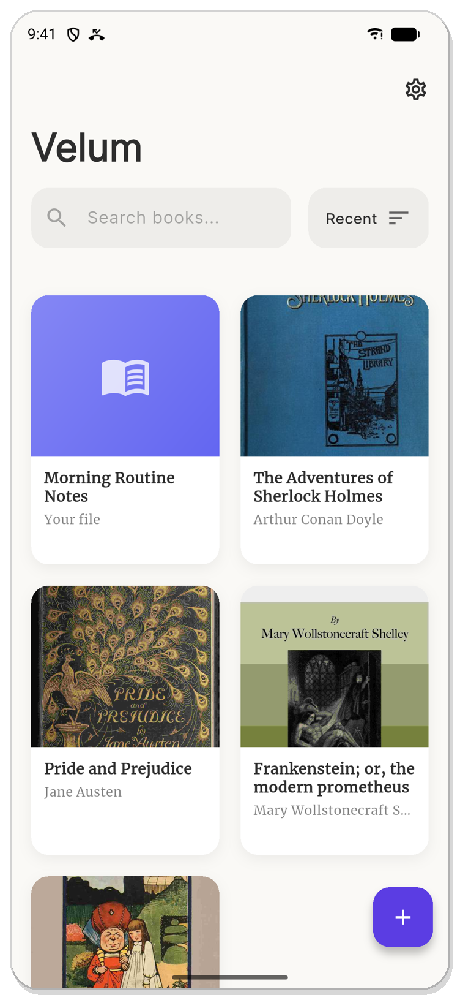
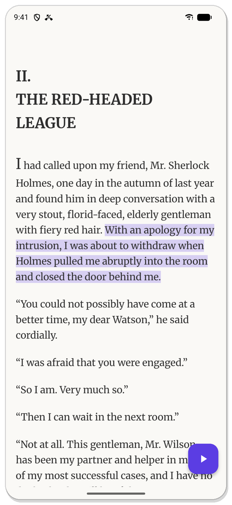
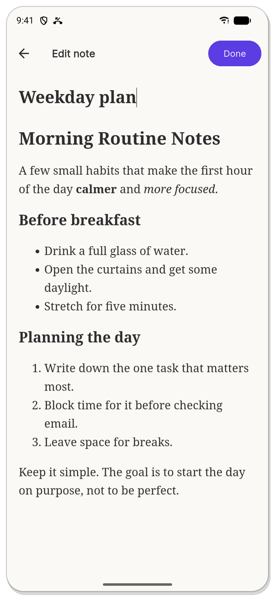
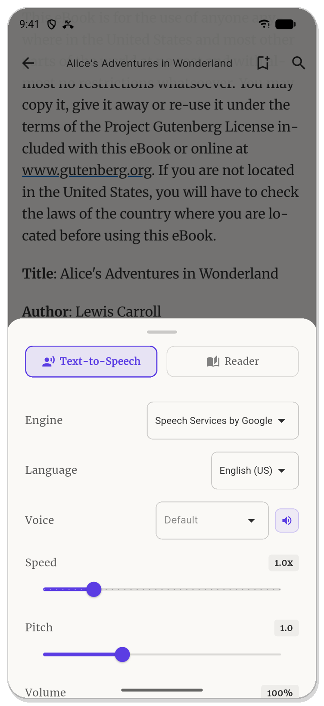
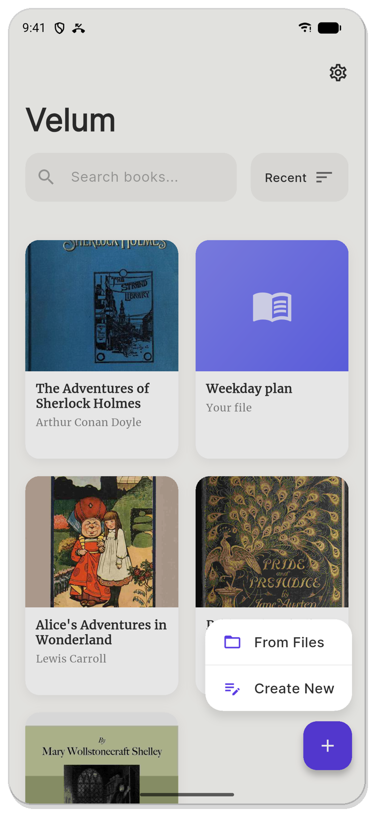
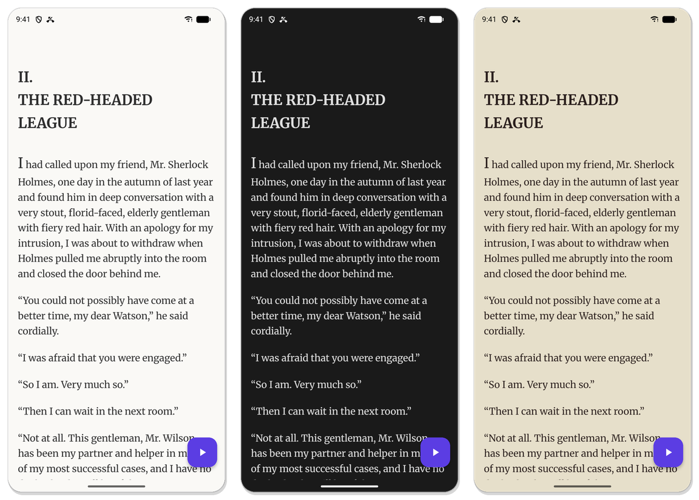
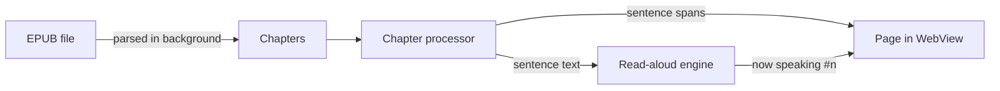

<div align="center">


# Velum

**A calm, distraction-free ebook reader that reads your books out loud.**

Open an EPUB, press play, and follow along as each sentence lights up.


[Features](#-features) · [Screenshots](#-screenshots) · [Read-aloud](#-read-aloud) · [Getting started](#-getting-started) · [How it works](#-how-it-works)

<br/>

&nbsp;
&nbsp;


</div>

---

## ✨ Features

- 🔊 **Read-aloud with live highlighting.** Uses your phone's own voice, works offline, and starts instantly. Each sentence or paragraph lights up as it's spoken.
- ▶️ **Starts where you are.** Press play to begin at the first sentence on screen, or double-tap any sentence to jump straight to it.
- 📝 **Create New.** Tap **+** → **Create New**, then write or paste anything (a whole Google Doc, an article, notes) and listen to it like a book. Headings, lists and bold/italic come along; colours and clutter don't.
- 📚 **Library.** Finds the EPUBs on your device automatically, with covers, search, sorting and pinning.
- 📖 **Remembers your place.** Every chapter keeps its own scroll position and read-aloud spot, even after you close the app.
- 🖍️ **Highlights and bookmarks.** Five highlight colours and exact-position bookmarks, all in one panel.
- 🔍 **Search the whole book** with snippets that take you right to the match.
- 🎨 **Light, dark and sepia** themes, plus fonts, size, spacing and margins, including your own font files.

## 📱 Screenshots

<table>
  <tr>
    <td align="center" width="33%"><br/><sub><b>Your library</b></sub></td>
    <td align="center" width="33%"><br/><sub><b>Each sentence lights up as it's read</b></sub></td>
    <td align="center" width="33%"><br/><sub><b>Voice, speed and pitch</b></sub></td>
  </tr>
  <tr>
    <td align="center"><br/><sub><b>Tap + for From Files or Create New</b></sub></td>
    <td align="center"><br/><sub><b>Paste a document. Formatting is kept</b></sub></td>
    <td></td>
  </tr>
</table>

<p align="center"><br/><sub><b>Light, dark and sepia</b></sub></p>

## 🔊 Read-aloud

| | |
|---|---|
| **Voices** | Any speech engine installed on the phone (e.g. Speech Services by Google, Samsung TTS) and any of its downloaded voices, with a one-tap preview. |
| **Speed** | 0.2× to 4×, in 0.1× steps. Pitch and volume adjustable too. |
| **Highlighting** | Sentence by sentence or paragraph by paragraph. The page follows the voice. |
| **Scroll freely** | Scroll away while it reads and the page stays put. A **Back to reading** button takes you back. |
| **Sleep timer** | Stop after 15, 30 or 60 minutes, or at the end of the chapter. It pauses, so you can pick up where you dozed off. |
| **Interruptions** | Notification sounds don't stop it. Calls pause it and it resumes afterwards. |
| **Lock screen** | Play, pause and skip paragraphs from the lock screen and notification. The book and chapter title are shown. |
| **Auto-continue** | Moves on to the next chapter by itself. |

> [!NOTE]
> **Microsoft Edge voices** are available as an *Experimental* option at the bottom of the voice settings. They sound more natural but need an internet connection and take longer to start.

## 🚀 Getting started

**Requirements:** [Flutter](https://docs.flutter.dev/get-started/install) 3.44+ and an Android device or emulator (Android 7.0+).

```bash
git clone https://github.com/iam-kanav/velum.git
cd velum
flutter pub get
flutter run
```

Build a release APK (one per CPU type; most phones use `arm64-v8a`):

```bash
flutter build apk --release --split-per-abi
```

Run the tests:

```bash
flutter test
```

<details>
<summary><b>More developer notes</b></summary>

<br/>

- **Hive adapters** (`*.g.dart`) are committed. Regenerate after changing a model:
  ```bash
  dart run build_runner build --delete-conflicting-outputs
  ```
- **Ads.** Without real ad unit IDs, builds show Google's test ads. Pass the real ones at build time:
  ```bash
  flutter build apk --release \
    --dart-define=AD_BANNER_ANDROID=ca-app-pub-xxx/yyy \
    --dart-define=AD_REWARDED_ANDROID=ca-app-pub-xxx/zzz
  ```
- **App icon.** The master artwork and scripts live in `branding/logo/`. `install_icons.sh` regenerates every Android, iOS and web icon.
- **Gradle downloads time out?** Some networks break Java's IPv6. Run builds with `JAVA_TOOL_OPTIONS="-Djava.net.preferIPv4Stack=true"`.

</details>

## 🧩 How it works



- **One source of truth.** When a chapter opens, a single pass marks every sentence on the page *and* records the text the voice will speak, so the highlight and the voice can't drift apart. 16 automated tests guard this.
- **Fast opening.** Only chapter text is read up front. Pictures are pulled from the book when a chapter needs them.
- **Your own notes.** A note (titled, or "Untitled Note" by default) is saved as a small one-chapter EPUB alongside its editable source, so it opens, plays and searches like any book.

<details>
<summary><b>Tech stack</b></summary>

<br/>

| Area | Package |
|---|---|
| Framework | Flutter, Dart 3.8 |
| State | `provider` |
| Navigation | `go_router` |
| EPUB parsing | `epubx` (background isolate, lazy images) |
| Rendering | `webview_flutter` + `assets/js/reader.js` |
| Speech | `flutter_tts` (device), `edge_tts` (experimental) |
| Audio | `just_audio`, `audio_service`, `audio_session` |
| Storage | `hive`, `shared_preferences` |
| Ads | `google_mobile_ads` |

</details>

<details>
<summary><b>Project structure</b></summary>

<br/>

```
lib/
├── main.dart                 # Startup: storage, audio service, providers
├── core/                     # Router, theme, ads
└── features/
    ├── library/              # Library screen, scanning, imports
    ├── notes/                # Create New: note editor + note storage
    ├── onboarding/           # First-launch setup
    ├── reader/               # Reader screen, chapter processor, highlights, bookmarks
    ├── settings/             # Reader settings and fonts
    └── tts/                  # Speech engines, playback, voice settings
assets/js/
├── reader.js                 # Page script: gestures, highlights, follow mode
└── editor.html               # Note editor: title, writing area, paste clean-up
test/                         # Sentence alignment and note tests
```

</details>

---

<div align="center">
<sub>Made with Flutter · Screenshots show public-domain books from <a href="https://www.gutenberg.org">Project Gutenberg</a></sub>
</div>
