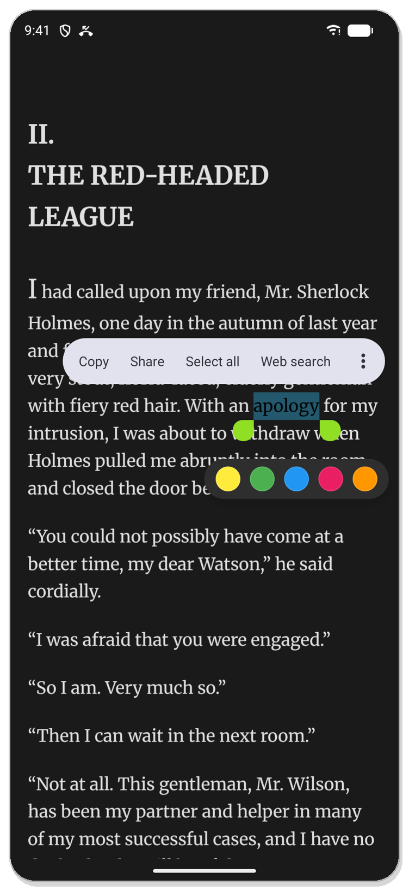
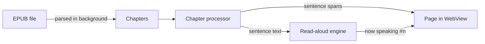

<div align="center">


# Velum

**An EPUB reader that reads your books out loud.**

Open a book, press play, and follow along as each sentence lights up.


[Features](#-features) · [Screenshots](#-screenshots) · [Getting started](#-getting-started) · [More features](#-more-features) · [License](#-license)

<br/>

&nbsp;
&nbsp;


</div>

---

## ✨ Features

- 📖 **EPUB reader.** A clean, distraction-free reader for your EPUB books, with search, a table of contents, and your place remembered in every chapter.
- 🔊 **Read-aloud with live highlighting.** Uses your phone's own voice, works offline, and highlights each sentence as it's spoken. Want something more natural? Turn on **neural voices** (Microsoft Edge, online) in the voice settings.
- 🎨 **Themes.** Light, dark and sepia, plus your choice of font, size, spacing and margins.
- 🗂️ **Collections.** Group books into collections like "Classics" or "To read", and optionally keep them out of your main library.
- 🖍️ **Highlights and bookmarks.** Highlight passages in five colours and bookmark your exact spot, all browsable from one panel.

## 📱 Screenshots

<p align="center"><br/><sub><b>Light, dark and sepia</b></sub></p>

<table>
  <tr>
    <td align="center" width="33%"><br/><sub><b>Your library</b></sub></td>
    <td align="center" width="33%"><br/><sub><b>Each sentence lights up as it's read</b></sub></td>
    <td align="center" width="33%"><br/><sub><b>Voice, speed and pitch</b></sub></td>
  </tr>
  <tr>
    <td align="center" width="33%"><br/><sub><b>Add books or create a note</b></sub></td>
    <td align="center" width="33%"><br/><sub><b>Paste a document to listen to</b></sub></td>
    <td align="center" width="33%"><br/><sub><b>Highlight right below your selection</b></sub></td>
  </tr>
</table>

## 🚀 Getting started

**Requirements:** [Flutter](https://docs.flutter.dev/get-started/install) 3.44+ and an Android device or emulator (Android 7.0+).

```bash
git clone https://github.com/iam-kanav/velum.git
cd velum
flutter pub get
flutter run
```

Build a release APK (one per CPU type; most phones use `arm64-v8a`):

```bash
flutter build apk --release --split-per-abi
```

Run the tests:

```bash
flutter test
```

<details>
<summary><b>Developer notes</b></summary>

<br/>

- **Hive adapters** (`*.g.dart`) are committed. Regenerate after changing a model:
  ```bash
  dart run build_runner build --delete-conflicting-outputs
  ```
- **Gradle downloads time out?** Some networks break Java's IPv6. Run builds with `JAVA_TOOL_OPTIONS="-Djava.net.preferIPv4Stack=true"`.

</details>

## ➕ More features

**Reading**
- Finds the EPUBs on your device automatically, or import them from your files.
- Covers, search, sorting and pinning in the library.
- Search the whole book, with snippets that jump straight to the match.
- Swipe between chapters; each chapter remembers its own scroll position.
- Import your own font files.
- Delete books from the library and, optionally, from your device.

**Listening**
- Pick any speech engine and voice installed on your phone, with a one-tap preview.
- Speed from 0.2× to 4×, plus pitch and volume.
- Highlight by sentence or by paragraph.
- Press play to start from what's on screen, or double-tap any sentence to jump to it.
- Scroll freely while it reads; **Back to reading** takes you back.
- Sleep timer: 15, 30 or 60 minutes, or the end of the chapter.
- Lock-screen and notification controls.
- Notification sounds don't stop it; calls pause it and it resumes afterwards.
- Moves on to the next chapter by itself.

**Notes**
- Tap **+** → **Create New** to write or paste anything (a whole Google Doc, an article) and listen to it like a book. Headings, lists and bold/italic are kept.

## 🧩 How it works



When a chapter opens, a single pass marks every sentence on the page *and* records the text the voice will speak, so the highlight and the voice can't drift apart. Automated tests guard this.

<details>
<summary><b>Tech stack</b></summary>

<br/>

| Area | Package |
|---|---|
| Framework | Flutter, Dart 3.8 |
| State | `provider` |
| Navigation | `go_router` |
| EPUB parsing | `epubx` |
| Rendering | `webview_flutter` + `assets/js/reader.js` |
| Speech | `flutter_tts` (device), `edge_tts` (neural, online) |
| Audio | `just_audio`, `audio_service`, `audio_session` |
| Storage | `hive`, `shared_preferences` |

</details>

<details>
<summary><b>Project structure</b></summary>

<br/>

```
lib/
├── main.dart                 # Startup: storage, audio service, providers
├── core/                     # Router and theme
└── features/
    ├── library/              # Library screen, collections, scanning, imports
    ├── notes/                # Note editor and note storage
    ├── onboarding/           # First-launch setup
    ├── reader/               # Reader screen, chapter processor, highlights, bookmarks
    ├── settings/             # Reader settings and fonts
    └── tts/                  # Speech engines, playback, voice settings
assets/js/
├── reader.js                 # Page script: gestures, highlights, follow mode
└── editor.html               # Note editor and paste clean-up
test/                         # Sentence alignment, note and collection tests
```

</details>

## 📄 License

Velum is open source under the [Apache License 2.0](LICENSE).

---

<div align="center">
<sub>Made with Flutter · Screenshots show public-domain books from <a href="https://www.gutenberg.org">Project Gutenberg</a></sub>
</div>
